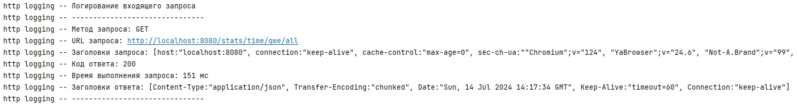
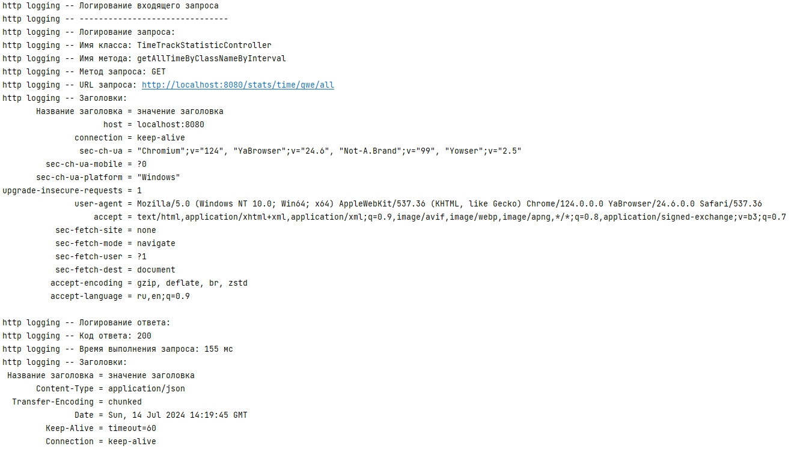
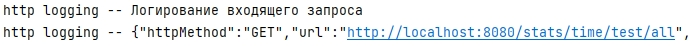

## Spring boot starter для логирования HTTP запросов  
  
Стартер предоставляет возможность логировать входящие и исходящие HTTP запросы в вашем приложении на базе Spring Boot.  
Исходящие запросы логируются только при отправке с помощью RestClient, когда он заинжекчен.  
### Стартер имеет следующие свойства:
1. `http.logging.enabled` - включает/выключает использование стартера.  
Допустимые значения (true/false).  
Значение по умолчанию - false.  
При значении false остальные свойства неактивны.  
При значении отличном от допустимого происходит ошибка при запуске.  
  
2. `http.logging.format` - формат вывода логов.  
Допустимые значения (text/json).  
Значение по умолчанию - text.  
При значении отличном от допустимого логи не выводятся.  
  
3. `http.logging.level` - уровень логирования.  
Учитывается при текстовом `http.logging.format=text` формате.  
Допустимые значения (INFO/DEBUG).  
Значение по умолчанию - INFO.  
При значении отличном от допустимого логи не выводятся.  

## Руководство по подключению  
  
Для использования стартера в вашем приложении spring boot необходимо:
1. Скачать стартер:  
`https://github.com/Prohkit/http-logging-spring-boot-starter.git`  
2. Выполнить следующую команду в консоли (в idea можно дважды нажать на ctrl),  
чтобы добавить стартер в локальный maven репозиторий.  
`mvn clean install`  
3. Добавить зависимость в pom.xml:    
`<dependency>`  
`<groupId>com.example</groupId>`
`<artifactId>http-logging-spring-boot-starter</artifactId>`
`<version>0.0.1-SNAPSHOT</version>`
`</dependency>`  
4. Для включения логирования в application.properties указать свойство:
`http.logging.enabled=true`  
  
## Формат логов  
  
При формате - **text**, уровне логирования - **INFO**:  
  
  

При логировании **исходящего запроса**:  
  
  
  
При формате - **text**, уровне логирования - **DEBUG**:  
  
  
  
При формате - **json**:  
  
  
  
Пример **json**:  
```json
{
  "httpMethod": "GET",
  "url": "http://localhost:8080/stats/time/test/all",
  "requestHeaders": [
    {
      "headerName": "host",
      "headerValue": "localhost:8080"
    }
  ],
  "responseStatus": "200",
  "executionTime": 23,
  "responseHeaders": [
    {
      "headerName": "Content-Type",
      "headerValue": "application/json"
    }
  ],
  "className": "TimeTrackStatisticController",
  "methodName": "getAllTimeByClassNameByInterval"
}
```